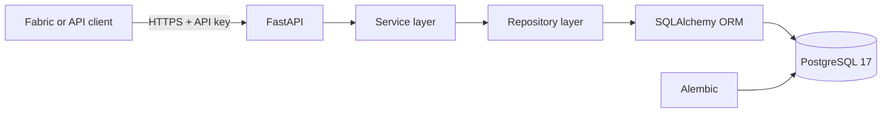

# BritMart Supplier and Procurement API

A production-style operational source system for a fictional large UK retailer. The service manages supplier master data, commercial product agreements, purchase orders, shipments and supplier performance, and exposes versioned REST endpoints for downstream ingestion into Microsoft Fabric.

This repository is one component of the wider **BritMart Retail Data Platform** portfolio project. The wider platform combines this API with SQL Server warehouse data, SharePoint store-sales files, Amazon S3 e-commerce data and selected real-time logistics events.

## Project status

| Capability | Status |
|---|---|
| Synthetic master and operational data generation | Complete |
| Cross-domain validation and reconciliation | Complete |
| FastAPI application and versioned endpoints | Complete |
| SQLAlchemy operational data model | Complete |
| Alembic database migrations | Complete |
| SQLite local development support | Complete |
| PostgreSQL 17 Docker Compose deployment | Complete |
| API-key authentication and standard error contracts | Complete |
| Structured JSON logging and request correlation | Complete |
| Controlled failure simulation | Complete |
| Automated API and database tests | Complete |
| Public cloud deployment | Planned |
| Microsoft Fabric incremental ingestion | Planned |

## Business context

BritMart operates stores, distribution centres, e-commerce channels and a network of product suppliers. This service simulates the independently owned supplier and procurement operational system used to:

- Maintain supplier records and operational status.
- Manage primary and secondary supplier-product agreements.
- Raise and track purchase orders.
- Track supplier shipments and shipment status histories.
- Reconcile ordered, shipped and received quantities.
- Calculate monthly supplier performance and risk indicators.
- Provide secure incremental data feeds to Microsoft Fabric.

## Architecture



The code follows a layered structure:

1. **API layer** — routing, authentication, request validation and response contracts.
2. **Service layer** — business orchestration and controlled errors.
3. **Repository layer** — database queries, filtering, pagination and stable ordering.
4. **Model layer** — relational entities, constraints, indexes and relationships.
5. **Database layer** — SQLAlchemy sessions, PostgreSQL/SQLite compatibility and Alembic migrations.

## Wider BritMart data platform

| Operational source | Business data | Planned ingestion pattern |
|---|---|---|
| Supplier REST API and PostgreSQL | Suppliers, agreements, orders, shipments and performance | Paginated full load followed by watermark-based incremental loads |
| SQL Server warehouse system | Goods receipts, inventory movements and warehouse operations | Incremental SQL extraction |
| SharePoint | Store point-of-sale files | Metadata-driven file ingestion |
| Amazon S3 | E-commerce orders, payments and fulfilment | Partition-aware object ingestion |
| Event streaming | Logistics and stock events | Near-real-time Fabric Eventstream ingestion |

Microsoft Fabric will orchestrate ingestion into Bronze, Silver and Gold layers, apply cross-source reconciliation and publish curated Power BI models.

## Technology stack

- Python 3.13
- FastAPI
- Pydantic and pydantic-settings
- SQLAlchemy 2
- Alembic
- PostgreSQL 17
- SQLite for lightweight local development
- Docker and Docker Compose
- Pytest
- Uvicorn

## Generated data volumes

The deterministic generators create a portfolio-scale operational release.

| Dataset | Records |
|---|---:|
| Suppliers | 50 |
| Products | 2,000 |
| Supplier-product agreements | 2,600 |
| Purchase orders | 8,000 |
| Purchase-order lines | 48,000 |
| Shipments | 9,847 |
| Shipment lines | 52,100 |
| Shipment status-history events | 36,761 |
| Supplier performance events | 17,235 |
| Supplier monthly scorecards | 577 |

Generated output files are intentionally excluded from Git. They can be recreated from the committed configurations and generators.

## API capabilities

The service exposes endpoints under `/api/v1` for:

- Suppliers
- Purchase orders and purchase-order lines
- Shipments, shipment lines and shipment status history
- Supplier performance events
- Supplier monthly performance scorecards

Operational endpoints:

| Endpoint | Purpose |
|---|---|
| `GET /health/live` | Application liveness |
| `GET /health/ready` | Application and database readiness |
| `GET /docs` | Swagger UI |
| `GET /redoc` | ReDoc documentation |
| `GET /openapi.json` | OpenAPI contract |

Collection endpoints require the configured `X-API-Key` header.

## Production-style incremental extraction

Collection endpoints support bounded pagination and controlled extraction windows:

```text
updated_since=2026-08-17T00:00:00Z
updated_before=2026-08-18T00:00:00Z
page=1
page_size=500
```

The intended Fabric ingestion pattern is:

1. Perform one paginated historical load.
2. Read the last successful watermark.
3. Fix an exclusive extraction-window upper boundary.
4. Request every page within the window.
5. Land immutable source records in Bronze.
6. Reconcile counts and keys.
7. Advance the watermark only after successful validation.

Stable ordering uses `updated_at` plus the entity primary key to prevent page overlap or omission.

## Operational controls

- API-key authentication.
- Pydantic request and response validation.
- Standard machine-readable error envelope.
- Request IDs propagated through headers, responses and logs.
- Structured JSON request logging.
- Response-time headers.
- Database liveness and readiness checks.
- Controlled HTTP failure and latency simulation for retry testing.
- Relational check constraints and foreign keys.
- Transactional data loading.
- Duplicate full-load prevention.
- Deterministic data generation and validation reports.
- Header-to-line and cross-system reconciliation.

## Repository structure

```text
app/
  api/                  FastAPI health and versioned routes
  core/                 Configuration, middleware, logging and errors
  db/                   SQLAlchemy base, engine and sessions
  dependencies/         Authentication and database dependencies
  models/               Operational SQLAlchemy models
  repositories/         Database query layer
  schemas/              Pydantic API contracts
  services/             Business service layer
data-generators/
  config/               Controlled generation parameters
  src/                  Generators and validators
  tests/                Data-generation test suites
docs/
  design/               Requirements, schema, API and Fabric design
  master-data/          Master-data specifications and key registry
migrations/             Alembic migration environment and revisions
scripts/                Operational database loading scripts
tests/
  api/                   API behaviour and resilience tests
  database/              Database integrity and reconciliation tests
compose.yaml             PostgreSQL and API services
Dockerfile               API container image
```

## Local environment setup

Create and activate a virtual environment:

```powershell
python -m venv .venv
.\.venv\Scripts\Activate.ps1
python -m pip install --upgrade pip
python -m pip install -r .\requirements-dev.txt
```

Create the local environment file:

```powershell
Copy-Item .\.env.example .\.env
```

Replace the example API key in `.env` with a secure local value. Never commit `.env`.

Create the SQLite development schema:

```powershell
python -m alembic upgrade head
```

Generate and validate the operational datasets before loading them:

```powershell
python .\data-generators\src\generate_operational_data_release.py
python .\data-generators\src\validate_operational_data_release.py
```

Load the operational database:

```powershell
python -m scripts.load_operational_data
```

Run the API:

```powershell
python -m uvicorn app.main:app --reload
```

Open `http://localhost:8000/docs`.

## Docker Compose with PostgreSQL

Create the Docker environment file:

```powershell
Copy-Item .\.env.docker.example .\.env.docker
```

Replace all example secrets in `.env.docker`, then start the services:

```powershell
docker compose --env-file .\.env.docker up --build -d
docker compose --env-file .\.env.docker ps
```

After both services are healthy, load the operational release once:

```powershell
docker compose --env-file .\.env.docker exec -T api python -m scripts.load_operational_data
```

Stop the services without deleting PostgreSQL data:

```powershell
docker compose --env-file .\.env.docker down
```

> `docker compose down -v` permanently removes the PostgreSQL volume and should only be used for an intentional clean rebuild.

## Example API request

```powershell
$headers = @{
    "X-API-Key" = "your-configured-api-key"
    "X-Request-ID" = "portfolio-smoke-001"
}

Invoke-RestMethod `
    -Uri "http://localhost:8000/api/v1/shipments?page=1&page_size=5" `
    -Headers $headers
```

## Testing

Run the generator test suites:

```powershell
python -m pytest .\data-generators\tests -q
```

Run the application and database test suites:

```powershell
python -m pytest .\tests\api .\tests\database -q
```

Check migration/model alignment:

```powershell
python -m alembic check
```

The completed local suites contain more than 270 automated checks across deterministic generation, schema validity, referential integrity, business reconciliation, authentication, pagination, incremental extraction, failure simulation, structured logging and database loading.

## Documentation

Detailed design documents are available in [`docs/design`](docs/design):

- [Business requirements](docs/design/01_business_requirements.md)
- [Entity relationship model](docs/design/02_entity_relationship_model.md)
- [Database schema](docs/design/03_database_schema.md)
- [API contract](docs/design/04_api_contract.md)
- [Fabric ingestion and reconciliation](docs/design/05_fabric_ingestion_reconciliation.md)

Master-data documentation is available in [`docs/master-data`](docs/master-data).

## Roadmap

1. Publish the repository and add GitHub Actions quality gates.
2. Deploy the API and PostgreSQL to a public cloud environment.
3. Configure secrets and production runtime settings.
4. Connect Microsoft Fabric to the deployed API.
5. Implement paginated historical and incremental ingestion.
6. Add the SQL Server, SharePoint and Amazon S3 source systems.
7. Implement Bronze, Silver and Gold transformations.
8. Add real-time logistics events, monitoring and Power BI reporting.

## Portfolio purpose

BritMart is a fictional retailer, and all records are synthetic. The project demonstrates production-oriented data engineering and API integration patterns without using confidential business data.
